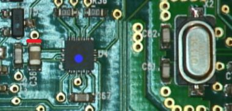
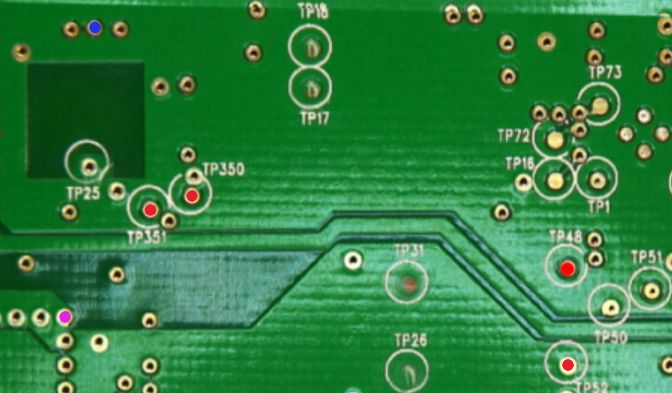

# I2C MMA8451Q/MMA8452Q emulator for the Toniebox
This implementents a rudimentary emulation for the acceleration sensor of the Toniebox to replace it with buttons. It is tested with the CC3200 Variant. The CC3235 may work. The ESP32 based box has a different acceleration sensor and is not supported!

## ATTENTION - THIS WILL VOID YOU WARRANTY
I did this mod without deep electrical knowledge. The voltage regulator should be able to handle the extra as the DAC is also connected to it. If there is anything bad, please let me know. If this breaks your box, don't blame me or Tonies!

## Known side effects
As I cannot cut the power of the pico, it need around 1mA when the box is off. When the box is running 30-50mAs extra.

## Cut the VDD of the MMA8452Q
Please cut the VDD of the MMA8452Q (blue) marked with the red line.
Just use a sharp knife and do the cut as the line suggest. Afterwards check if the vias above the line and the capacitor below are not connected anymore. 

Hint: If you want to remove this mod, you'll just need resolder this connection and the MMA8452Q works again.

## Pinout
### Required

| Pico | Toniebox | Function |
| --- | --- | --- |
| GND | GND | Ground (pink) |
| GP03 | MMA-INT | IRQ pin (blue) |
| GP04 | TP351 | SDA |
| GP05 | TP350 | SCL |
| GP14 | TP48 | Sleep detection |
| 3V3 | TP52 | Power |

### Optional (buttons)
| Pico | Function |
| --- | --- |
| GP06 | Tap right |
| GP07 | Tap left |
| GP08 | Tilt left |
| GP09 | Tilt right |
| GP10 | Short tap right, hold tilt left |
| GP11 | Short tap left, hold tilt right |
| GP10+11 | Hold both, box is headsdown |
| BOOTSEL | Short tap left, hold box is headsdown |

## Compiling manually - Setup

Follow the instructions in [Getting started with Raspberry Pi Pico](https://datasheets.raspberrypi.org/pico/getting-started-with-pico.pdf) to setup your build environment. You'll also need pico-extras!
Then:

- `git clone https://github.com/toniebox-reverse-engineering/pico_i2c_slave-toniebox`
- `cd pico_i2c_slave-toniebox`
- `mkdir build`, `cd build`, `cmake ../`, `make`
- copy `example_mem/example_mem.uf2` to Raspberry Pico
- open a serial connection and check output

## Links

- [Pico as I2C slave](https://www.raspberrypi.org/forums/viewtopic.php?t=304074) - basic setup using raw registers
- [DroneBot Workshop](https://dronebotworkshop.com/i2c-part-2-build-i2c-sensor/) - building an I2C sensor

## Authors

- Valentin Milea <valentin.milea@gmail.com> (I2C_Slave lib)
- 0xbadbee aka. SciLor (MMA8452Q emulator)
